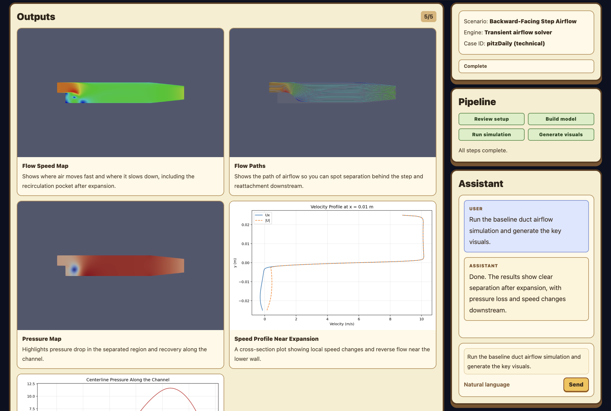

# FlowPilot

Talk to your simulations like they understand you — because now they do.



FlowPilot wraps OpenFOAM behind a conversational UI powered by Claude. You describe what you want in plain English; it configures the case, runs the solver, generates visuals, and explains the results.

## How it works

1. You type a prompt like *"Run the baseline duct airflow simulation and generate the key visuals."*
2. The assistant reviews the setup, builds the mesh, runs the solver, and renders outputs.
3. Visuals (velocity fields, streamlines, pressure maps, profiles) appear in the workspace as they're generated.
4. The assistant summarizes the results in the chat panel.

## Quick start

```bash
cd openfoam-chat-mvp
cp .env.example .env.local
# Set ANTHROPIC_API_KEY and adjust paths in .env.local
npm install
npm run dev
```

Open `http://localhost:3000/demo` and click **Run analysis**.

## Environment variables

| Variable | Description |
|---|---|
| `ANTHROPIC_API_KEY` | Your Anthropic API key |
| `ANTHROPIC_MODEL` | Claude model to use (default: `claude-sonnet-4-6`) |
| `OPENFOAM_TEMPLATE_CASE` | Path to the tutorial case used as the template |
| `OPENFOAM_WORK_ROOT` | Ephemeral workspace directory (copied from template before each run) |
| `OPENFOAM_BASHRC` | Path to OpenFOAM's `bashrc` for sourcing before commands |
| `OPENFOAM_ARTIFACT_DIR` | Directory for generated PNGs/CSVs served to the UI |
| `OPENFOAM_DEMO_ASSET_DIR` | Pre-built visualization assets for the `/demo` route |

## Architecture

- **Next.js 15** with App Router and Tailwind v4
- **Anthropic Messages API** with a tool-use loop (not the Agent SDK)
- **Local OpenFOAM workspace** — copied from a template, reset per run
- **No database, no queue, no multi-tenancy** — single user, single case, ephemeral

### Request flow

1. User sends a chat prompt
2. `POST /api/chat` builds a Messages API request with OpenFOAM tools
3. Claude returns text and tool-use blocks
4. Backend executes each tool locally (mesh, solve, render, etc.)
5. Tool results loop back until Claude produces a final answer
6. Frontend refreshes the workspace and artifact list

### API routes

| Route | Method | Purpose |
|---|---|---|
| `/api/chat` | POST | Primary chat endpoint — prompt in, assistant response + artifacts out |
| `/api/state` | GET | Current workspace summary |
| `/api/reset` | POST | Wipe and re-copy workspace from template |
| `/api/artifacts` | GET | List generated artifacts |
| `/api/artifacts/[...path]` | GET | Stream an artifact file |
| `/api/demo-assets/[name]` | GET | Serve pre-built visualization assets |

### Claude tools

| Tool | Actions |
|---|---|
| `openfoam_case_inspect` | `summary`, `read_file`, `list_files` |
| `openfoam_case_edit` | `write_file`, `replace_text` (scoped to case dictionaries) |
| `openfoam_run` | `block_mesh`, `check_mesh`, `run_case`, `postprocess`, `render_phase1` |
| `openfoam_artifacts` | `list`, `read_text` |

## Tech stack

- Next.js 15, React 19, TypeScript
- Tailwind CSS v4
- Anthropic Claude SDK
- OpenFOAM 12 (local)

## What's not built yet

- Authentication / multi-user
- Persistent job history
- Background queues
- Multi-case uploads
- Arbitrary shell access
